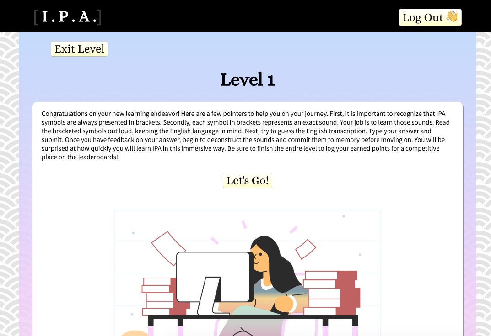

# [ aI pi eI ]  IPA Learning App
This app is a gateway to your immersive International Phonetic Alphabet learning experience!

## Live Version
[See the live app here](https://pacific-basin-65264.herokuapp.com)
Enter the app to compete with others while learning to use an amazing Phonetic system utilized by linguists, speech-language pathologists, foreign-language students, translators, actors and classical singers!

Have you ever wondered about those funny looking symbols next to each entry in the dictionary that are supposed to help with pronunciation? Leave these lessons with a greater ability to read between those brackets! Soon you'll be pronouncing new foreign-language words flawlessly as well.

Let the learning begin!

## API
This repository is client only.
[Find the server repository here](https://github.com/amyspeed/IPA-Back-End).

## Take a Look Inside!

### Landing Page
Users are welcomed and introduced to the app. Users can register for a new account, log into their existing account, or access a demo. Once logged in, users are taken to the Dashboard.

### Dashboard
Once logged in, users are taken to their dashboard. They are greeted by first name. A Toast notification lets the user know how far they are from reaching the top score. Below the learning-module links, the user can view their own current standing for level 1, 2, 3, and total score. The leaderboards follow. The user can view leaderboards for total scores and for each of the three levels. From this page, the user can access their authorized course modules or log out.

### Learning Module
Entering through one of the "level" buttons, the user is taken to the learning module. The user is first introduced to the level and offered advice. Once clicking the "Let's Go" button, the user begin's their learning journey.

IPA examples are offered in a unicode serif typeface capable of capturing all necessary symbols. Once the user submits their guesses, the submit button and input are replaced with feedback. Scores are only recorded at the very end with the "submit score" button and a return to the dashboard. 

Links to the dashboard can be accessed by clicking anywhere on the navigation bar (other than the log out button) and by clicking the "exit level" button. Both options exit without saving the user's new score. The user can also log out from the module.

## Technologies

### Front End
* React
* Redux
* HTML5
* CSS3
* JavaScript

### Back End
* Node.js
* Express
* MongoDB
* Mongoose
* Mocha
* Chai

### DevOps
* Travis CI
* mLab
* Heroku

## Author

Amy Speed-Henley